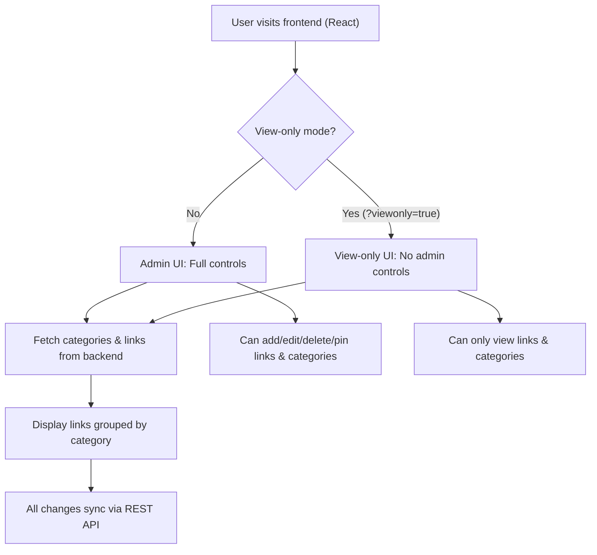

# LinkDisplay

A modern, full-stack web application for organizing and managing links with categories. Built with a React frontend and a modular Flask backend, LinkDisplay is production-ready, fully tested, and easy to deploy or share.

---

## 🌐 Live Demo & Sharing

- **Admin Mode:** Full access at your deployed URL (or `localhost:3000` in development)
- **View-Only Mode:** Share a public, restricted view by appending `?viewonly=true` to the URL (e.g., for Instagram bio)

---

## 🗺️ Project Structure

```
LinkDisplay/
├── backend/    # Flask REST API (business logic, database, tests)
├── frontend/   # React app (UI, view-only mode, admin controls)
└── README.md   # (this file)
```

- See [frontend/README.md](frontend/README.md) and [backend/README.md](backend/README.md) for in-depth details.

---

## 🚀 Quick Start

### 1. Clone the Repository

```bash
git clone https://github.com/krishnapranayangara/linksdisplay.git
cd linksdisplay
```

### 2. Start the Backend

```bash
cd backend
python3 -m venv venv
source venv/bin/activate
pip install -r requirements.txt
python app.py
```
- The backend runs at [http://localhost:3001](http://localhost:3001) by default.

### 3. Start the Frontend

```bash
cd ../frontend
npm install
npm start
```
- The frontend runs at [http://localhost:3000](http://localhost:3000) by default.

---

## 🏄‍♂️ User Flow

### 1. **Admin Mode (default)**
- **Full CRUD:** Add, edit, delete, and pin links and categories.
- **UI Controls:** All admin buttons and modals are visible.
- **Usage:** For your own management and editing.

### 2. **View-Only Mode**
- **URL:** Add `?viewonly=true` to the URL (e.g., `https://yourdomain.com/?viewonly=true`)
- **Restricted UI:** All admin controls (add/edit/delete/pin) are hidden.
- **Usage:** Share this link publicly (e.g., Instagram bio) for a clean, read-only experience.

---

## 🔄 Application Flow Diagram



---

## 🧩 Architecture Overview

- **Frontend:**  
  - React (Create React App)
  - Custom logo, modern UI, responsive design
  - View-only mode via URL param
  - API integration with backend
  - Comprehensive tests with Jest + React Testing Library

- **Backend:**  
  - Flask (modular, production-grade)
  - SQLAlchemy ORM (SQLite by default, easy to switch to PostgreSQL)
  - RESTful API: `/api/categories`, `/api/links`, `/api/errors`, etc.
  - Error logging, health checks, statistics, and middleware
  - 74+ automated tests (pytest)

---

## 🧪 Testing

- **Frontend:**  
  - `cd frontend && npm test`
  - 6+ tests: UI rendering, API integration, error handling

- **Backend:**  
  - `cd backend && pytest`
  - 74+ tests: endpoints, models, services, error logging, middleware

- **All tests pass by default.**  
  - See commit history for test results.

---

## 📦 Deployment

- **Backend:**  
  - Production: Use Gunicorn or Docker (see backend/README.md)
  - Environment variables for DB, secret key, etc.

- **Frontend:**  
  - Build with `npm run build` for static hosting

---

## 📚 API Overview

- **Categories:**  
  - `GET /api/categories` — List all
  - `POST /api/categories` — Create
  - `PUT /api/categories/{id}` — Update
  - `DELETE /api/categories/{id}` — Delete

- **Links:**  
  - `GET /api/links` — List all
  - `POST /api/links` — Create
  - `PUT /api/links/{id}` — Update
  - `DELETE /api/links/{id}` — Delete
  - `PATCH /api/links/{id}/pin` — Pin/unpin

- **Error Logging, Health, Stats:**  
  - See [backend/README.md](backend/README.md) for full API docs

---

## 📝 About

Built with ❤️ by perspective computing.

---

## 🤝 Contributing

1. Fork the repo
2. Create a feature branch
3. Add tests for new features
4. Open a pull request

---

## 🆘 Support

- For issues, open a GitHub issue or see the API docs at `/api/docs`.

--- 