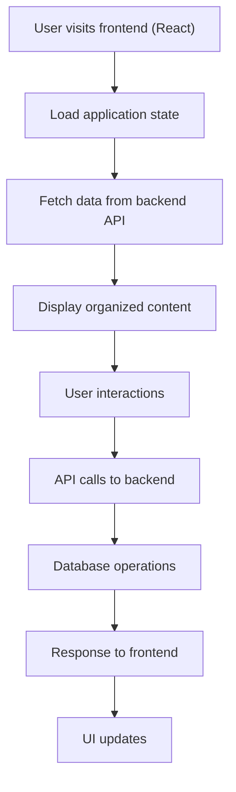

# LinkDisplay

A modern, full-stack web application for organizing and managing links with categories. Built with a React frontend and a modular Flask backend, LinkDisplay is production-ready, fully tested, and easy to deploy.

---

## 🗺️ Project Structure

```
LinkDisplay/
├── backend/    # Flask REST API (business logic, database, tests)
├── frontend/   # React app (UI, responsive design, API integration)
└── README.md   # (this file)
```

- See [frontend/README.md](frontend/README.md) and [backend/README.md](backend/README.md) for in-depth details.

---

## 🚀 Quick Start

### 1. Clone the Repository

```bash
git clone https://github.com/krishnapranayangara/linksdisplay.git
cd linksdisplay
```

### 2. Start the Backend

```bash
cd backend
python3 -m venv venv
source venv/bin/activate
pip install -r requirements.txt
python app.py
```

### 3. Start the Frontend

```bash
cd ../frontend
npm install
npm start
```

---

## 🔄 Application Flow



---

## 🧩 Architecture Overview

- **Frontend:**  
  - React (Create React App)
  - Modern UI with responsive design
  - RESTful API integration
  - Comprehensive testing with Jest + React Testing Library

- **Backend:**  
  - Flask (modular, production-grade)
  - SQLAlchemy ORM (SQLite by default, PostgreSQL ready)
  - RESTful API with comprehensive endpoints
  - Error logging, health checks, and monitoring
  - 74+ automated tests (pytest)

---

## 🧪 Testing

- **Frontend:**  
  - `cd frontend && npm test`
  - 6+ tests covering UI rendering and API integration

- **Backend:**  
  - `cd backend && pytest`
  - 74+ tests covering endpoints, models, and services

- **All tests pass by default.**

---

## 📦 Deployment

- **Backend:**  
  - Production: Use Gunicorn or Docker (see backend/README.md)
  - Configure environment variables for production settings

- **Frontend:**  
  - Build with `npm run build` for static hosting

---

## 📚 API Overview

- **Categories:** Full CRUD operations
- **Links:** Full CRUD operations with pinning functionality
- **Health & Monitoring:** System health checks and statistics
- **Error Logging:** Comprehensive request/response logging

See [backend/README.md](backend/README.md) for complete API documentation.

---

## 📝 About

Built with ❤️ by perspective computing.

---

## 🤝 Contributing

1. Fork the repository
2. Create a feature branch
3. Add tests for new functionality
4. Ensure all tests pass
5. Submit a pull request

---

## 🆘 Support

- For issues and questions, open a GitHub issue
- Check the API documentation at `/api/docs` when running locally

--- 